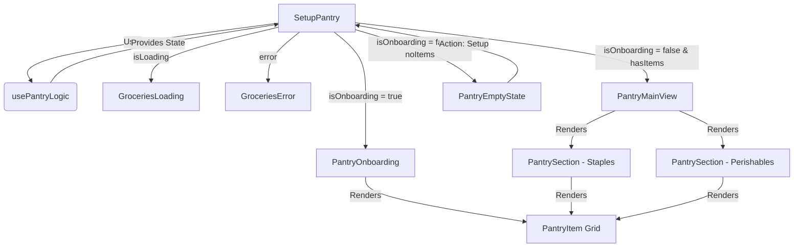

# Pantry Components Structure

This directory contains the components for the Pantry Setup and Inventory Management feature.

## Component Flow

The main entry point is `SetupPantry.tsx`, which orchestrates the flow based on the state provided by `usePantryLogic.ts`.

## Component Descriptions

### Core Logic
- **`usePantryLogic.ts`** (now in `hooks/`): Custom hook that handles all business logic:
    - Fetches grocery and inventory data.
    - Manages local state for selected items (`inventoryItems`).
    - Filters items for display (Staples vs Perishables).
    - Handles "Onboarding" vs "Main View" logic.
    - Provides `saveInventory` function to persist changes.

### Views
- **`SetupPantry.tsx`**: The container component. It doesn't hold state but decides which view to render based on the data from `usePantryLogic`.
- **`PantryOnboarding.tsx`**: The initial setup screen. Shows a list of default staples (`onboardingItems`) for the user to quickly check off.
- **`PantryMainView.tsx`**: The main inventory dashboard. Displays items categorized into "Staples" and "Perishables". Only shows items *not* currently in the inventory (to allow adding more).
- **`PantryEmptyState.tsx`**: Shown when the user has no items in their inventory and no items in their grocery list to add.

### UI Components
- **`PantrySection.tsx`**: A reusable section component used in `PantryMainView` to render a titled group of items (e.g., "Staples").
- **`PantryItem.tsx`**: The individual card component for a grocery item. Handles the display of the image, name, and selection state (checkmark).
